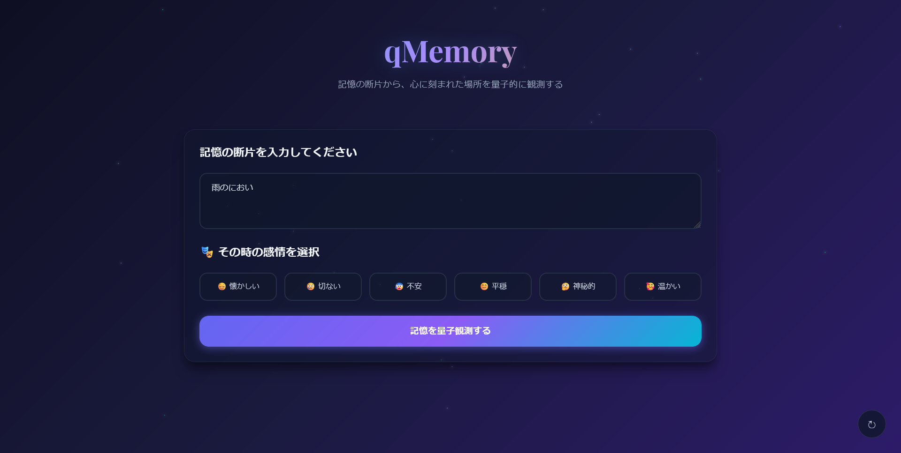
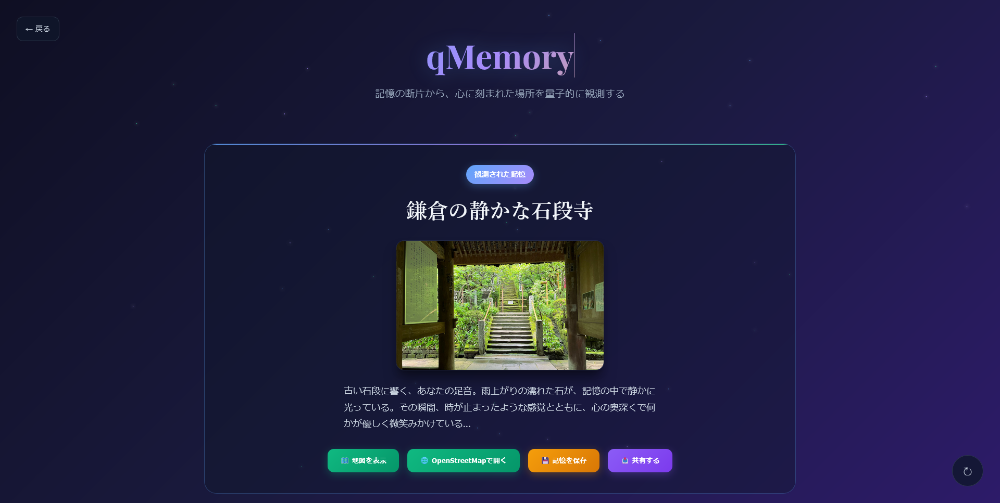

# 🌌 Quantum Location Recall (qMemory)

記憶の断片から、心に刻まれた場所を量子的に観測するアプリケーション

## 📸 画面イメージ

<p align="center">
  
</p>

<p align="center">
  
</p>

## 🎯 プロジェクト概要

**名称：** qMemory  
**目的：** 曖昧な記憶の断片（テキスト・感情など）をもとに、生成AIと量子的アプローチを活用し、ユーザーの心に残っていた可能性のある「場所」を提示する。

### ゴール定義

- ユーザーの記憶断片から **実在の地名・場所**を1件メイン出力
- 必要に応じて 2〜4件の「あり得たかもしれない場所」を表示
- 画像・ストーリー・地図情報を統合し、**意味のある記憶体験**を提供

## 🔬 コア概念（量子的設計思想）

| 量子概念 | アプリでの働き |
| -------- | -------------- |
| **重ね合わせ** | 入力から導いた複数の場所候補を"揺らぎ"として同時保持 |
| **干渉** | キーワード・感情が候補同士を強め合い／弱め合い、確率を再配分 |
| **観測** | ボタン押下で波が収束し、最も確からしい 1 地点を提示 |
| **残響** | 選ばれなかった候補を「影」として控えめに示し、記憶の余韻を可視化 |

## 🚀 技術スタック

### フロントエンド
- **Next.js 14** - React フレームワーク (App Router)
- **TypeScript** - 型安全性
- **Tailwind CSS** - モダンなスタイリング
- **Framer Motion** - アニメーション
- **React Leaflet** - 地図表示

### バックエンド
- **FastAPI** - 高性能 Python API
- **Qiskit** - IBM量子コンピューティング
- **Cirq** - Google量子コンピューティング
- **NumPy/SciPy** - 数値計算

### API連携
- **Google Gemini API** - 生成AI（メイン）
- **OpenAI GPT-4** / **DALL·E 3** (オプション)
- **OpenStreetMap** - 地図情報
- **Mapbox** / **Google Maps** (オプション)

## 📁 プロジェクト構造

```
qmemory/
├── src/                    # Next.js フロントエンド
│   ├── app/
│   │   ├── globals.css     # グローバルスタイル
│   │   ├── layout.tsx      # レイアウト
│   │   ├── page.tsx        # メインページ
│   │   ├── settings/       # 設定ページ
│   │   └── api/            # API ルート
│   ├── components/         # React コンポーネント
│   ├── types/              # TypeScript 型定義
│   └── utils/              # ユーティリティ
├── backend/                # FastAPI バックエンド
│   ├── main.py            # メインアプリケーション
│   ├── quantum_engine.py  # 量子計算エンジン
│   ├── models.py          # データモデル
│   └── requirements.txt   # Python依存関係
├── docs/                  # ドキュメント・画像
├── package.json           # Node.js 依存関係
├── tailwind.config.ts     # Tailwind設定
└── tsconfig.json          # TypeScript設定
```

## 🛠️ セットアップ

### 1. 依存関係のインストール

#### フロントエンド
```bash
npm install
```

#### バックエンド
```bash
cd backend
pip install -r requirements.txt
```

### 2. 環境変数の設定

#### フロントエンド (.env.local)
```
BACKEND_URL=http://localhost:8010
NEXT_PUBLIC_BACKEND_URL=http://localhost:8010
NEXT_PUBLIC_GEMINI_API_KEY=your_gemini_api_key_here
```

#### バックエンド (backend/.env)
```
ENVIRONMENT=development
DEBUG=True
CORS_ORIGINS=["http://localhost:3000", "http://localhost:3001"]
LOG_LEVEL=info
```

### 3. 開発サーバーの起動

#### バックエンド
```bash
cd backend
python main.py
# または
uvicorn main:app --reload --host 0.0.0.0 --port 8000
```

#### フロントエンド
```bash
npm run dev
```

アプリケーションは以下でアクセス可能：
- フロントエンド: http://localhost:3000 (or 3001)
- バックエンドAPI: http://localhost:8010
- API ドキュメント: http://localhost:8010/docs

## 📱 機能

### ユーザーフロー

1. 記憶断片をテキストで入力
2. 感情を選択（例：「懐かしい」「不安」）
3. 生成AIが候補を生成
4. 意味的類似度や感情干渉により1件を「観測」
5. 結果として提示（画像、ストーリー、地図リンクなど）

### コア機能一覧

| 機能カテゴリ | 概要 |
|---------------|------|
| 記憶入力 | テキスト + 感情選択（6種類） |
| 候補生成 | 生成AIで「場所候補 + 記述」を生成 |
| 観測処理 | 意味重み付け + サンプリングで1件選出 |
| 結果表示 | 地名 + ストーリー + 画像 + マップ |
| 記録保存 | 気に入った記憶をローカルに保存 |

### 量子状態表示
- **コヒーレンス**: 量子状態の純粋度
- **もつれ度**: 記憶-感情相関
- **重ね合わせ**: 量子位相分散

## 🔬 量子アルゴリズム詳細

### 記憶量子化プロセス
1. テキスト→ベクトル変換
2. 量子振幅エンコーディング
3. 位相情報の付与
4. 正規化・純粋化

### 感情-記憶もつれ
1. テンソル積によるもつれ状態生成
2. ベル状態要素の導入
3. エンタングルメント測度計算

### 干渉・観測アルゴリズム（疑似量子処理）
1. 生成AIで候補を生成（地名 + 情景テキスト）
2. 各候補と記憶断片の意味距離・感情類似度を評価
3. 干渉スコア（確率振幅）を割り当ててランク付け
4. 確率分布から1件を観測（選出）

## 🎨 デザインシステム

### カラーパレット
- **Quantum Blue**: 量子テーマカラー
- **Cosmic Purple**: 宇宙的要素
- **Emerald Green**: 自然・成長
- **Dark Gradients**: 深宇宙背景
- **VSCode Theme**: ダークモード対応

### アニメーション
- **パーティクルシステム**: 量子粒子の動き
- **Framer Motion**: スムーズなトランジション
- **ガラスモーフィズム**: 現代的なUI

## 🧪 開発・テスト

### コードの品質チェック
```bash
# TypeScript型チェック
npm run type-check

# ESLint
npm run lint

# Next.js ビルド
npm run build
```

### バックエンドテスト
```bash
cd backend
# APIのヘルスチェック
curl http://localhost:8010/health

# 量子システム状態確認
curl http://localhost:8010/api/quantum/state
```

## 📊 API エンドポイント

### 量子分析
- `POST /api/quantum/analyze` - 記憶の量子分析
- `GET /api/quantum/state` - 量子システム状態

### Gemini API
- `POST /api/gemini/analyze` - Gemini による記憶分析
- `POST /api/gemini/test` - API接続テスト

### ユーティリティ
- `GET /health` - ヘルスチェック
- `POST /api/memory/save` - 記憶の保存
- `GET /api/locations/coordinates/{name}` - 座標取得

## 📈 精度・体験評価軸

| 評価項目 | 測定方法 |
|-----------|------------|
| 主観納得度 | ユーザーのYes/No評価や5段階評価 |
| 再現性 | 同じ入力での複数回実行結果の一貫性 |
| 使い続けたくなる度 | 保存率・再訪率などの行動指標 |
| 意味類似度 | 入力と出力語の意味ベクトル距離 |

## 🚀 本番デプロイ

### フロントエンド (Vercel推奨)
```bash
npm run build
npm start
```

### バックエンド (Docker)
```dockerfile
FROM python:3.11-slim
WORKDIR /app
COPY requirements.txt .
RUN pip install -r requirements.txt
COPY . .
CMD ["uvicorn", "main:app", "--host", "0.0.0.0", "--port", "8010"]
```

## 🌟 今後の拡張

### 近期目標
- **リアル量子ハードウェア連携**: IBM Quantum Network
- **AI統合**: LLMとの量子-古典ハイブリッド
- **記憶データベース**: 個人記憶の永続化

### 将来拡張アイデア
- **VR/AR統合**: 没入型記憶体験
- **量子機械学習**: より高精度な予測
- **SNS投稿**や現地情報との連携
- **音・匂い**などの入力対応（記憶の強化）
- **夢や感情履歴**との連携

## 📄 ライセンス

MIT License

## 🤝 コントリビューション

プルリクエストを歓迎します。大きな変更については、まずIssueで議論してください。

## 📞 サポート

- GitHub Issues
- 量子コンピューティング相談
- UI/UX フィードバック

## まとめ

- **観測出力：** 記憶から導き出された"1つの場所"
- **量子要素：** 重ね合わせ → 干渉 → 観測モデルで表現
- **技術実現性：** Next.js + Gemini API + DALL·E で完結可能