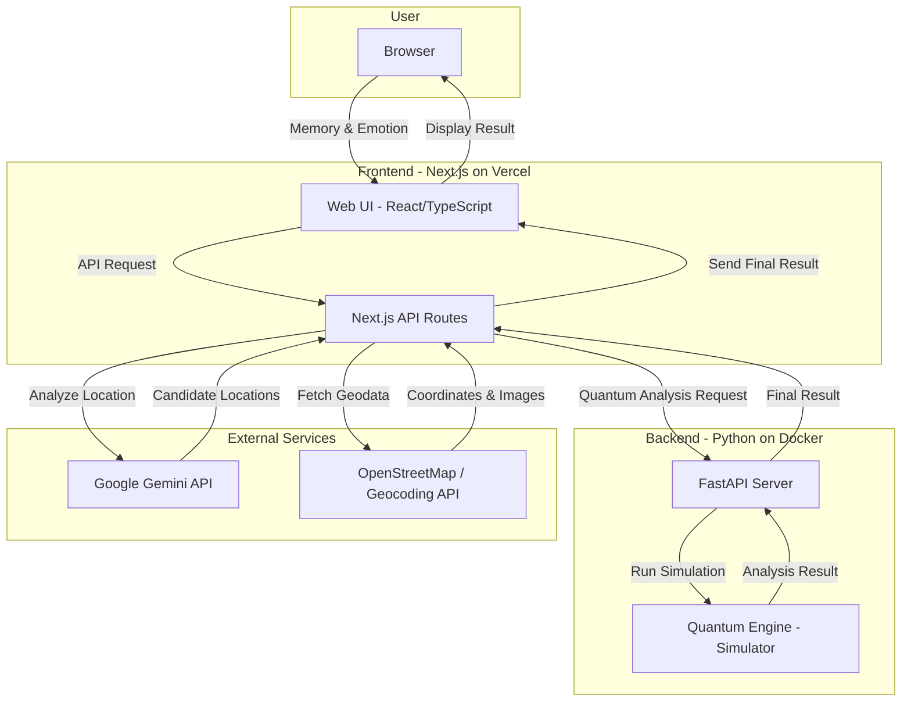

# QMemory - 量子記憶再構成システム

> 記憶の断片から、心に刻まれた場所を量子的に観測するアプリケーション

<div align="center">

[](https://nextjs.org/)
[](https://reactjs.org/)
[](https://www.typescriptlang.org/)
[](https://fastapi.tiangolo.com/)
[](https://ai.google.dev/)

</div>

## 概要

**QMemory**は、曖昧な記憶の断片（テキスト・感情）をもとに、AIと量子コンピューティングの概念を組み合わせて、ユーザーの心に残る「場所」を再構成するWebアプリケーションです。ユーザーが入力した情報から、AIが場所の候補を生成し、量子シミュレーションによって最も可能性の高い場所を「観測」します。

### 主な機能

-   **記憶入力:** テキストで曖昧な記憶を入力します。
-   **感情選択:** 記憶に紐づく感情を選択し、分析の精度を高めます。
-   **量子処理の視覚化:** 場所の候補が重ね合わせ状態から一つに収束する様子をアニメーションで表現します。
-   **場所の特定:** 最も可能性の高い場所を地図や関連情報と共に提示します。
-   **結果の共有:** 生成された記憶のイメージを画像として保存・共有できます。

## アーキテクチャ

このシステムは、Next.jsによるフロントエンド、FastAPIによるバックエンド、そして外部のAI/地理情報APIから構成されています。



## 処理フロー

1.  **入力:** ユーザーがブラウザで記憶の断片と感情を入力します。
2.  **AI分析:** Next.jsのAPIルートがGoogle Gemini APIを呼び出し、入力内容から関連性の高い場所の候補リスト（地名、説明など）を生成します。
3.  **量子シミュレーション:**
    -   生成された場所の候補リストを、FastAPIバックエンドに送信します。
    -   バックエンドの量子エンジンが、各候補を量子ビットの重ね合わせ状態として表現し、シミュレーションを実行します。
    -   入力された感情やキーワードがバイアスとなり、特定の場所の確率振幅を強めます。
4.  **観測:** シミュレーションの結果、最も確率の高い場所が「観測」され、主要な結果として決定されます。確率が低いいくつかの候補も副次的な結果として保持されます。
5.  **結果生成:**
    -   Next.jsのAPIルートが、決定した場所の地理情報（座標）や関連画像を外部APIから取得します。
    -   全ての結果を統合し、フロントエンドに返却します。
6.  **表示:** フロントエンドが結果を受け取り、地図、ストーリー、重ね合わせ状態の他の候補などを視覚的に表示します。

## 技術スタック

| 分類         | 技術                               |
| :----------- | :--------------------------------- |
| **フロントエンド** | Next.js, React, TypeScript, Tailwind CSS, Framer Motion |
| **バックエンド**   | FastAPI (Python), Uvicorn          |
| **AI**           | Google Gemini API                  |
| **地図・地理情報** | React Leaflet, OpenStreetMap       |
| **インフラ**     | Vercel (Frontend), Docker (Backend)|

## セットアップと実行

### 前提条件

-   Node.js (v18以上)
-   Python (v3.9以上)
-   Docker
-   Google Gemini APIキー

### 1. リポジトリのクローン

```bash
git clone https://github.com/your-username/qmemory.git
cd qmemory
```

### 2. 環境変数の設定

ルートディレクトリに`.env.local`ファイルを作成し、以下の内容を記述します。

```env
# Google Gemini APIキー
GEMINI_API_KEY="YOUR_GEMINI_API_KEY"

# バックエンドサーバーのURL
NEXT_PUBLIC_BACKEND_URL="http://localhost:8000"
```

### 3. バックエンドの起動 (Docker)

```bash
docker-compose up --build
```
(注: `docker-compose.yml`が存在しない場合は、Dockerfileを使用してビルド・実行してください)

### 4. フロントエンドの起動

新しいターミナルを開き、以下を実行します。

```bash
npm install
npm run dev
```

アプリケーションが [http://localhost:3000](http://localhost:3000) で起動します。

## ディレクトリ構成

```
qmemory/
├── backend/              # Pythonバックエンド (FastAPI)
│   ├── main.py           # APIエントリーポイント
│   ├── quantum_engine.py # 量子シミュレーションロジック
│   └── requirements.txt  # Python依存パッケージ
├── src/                  # Next.jsフロントエンド
│   ├── app/              # App Router
│   │   ├── api/          # APIルート
│   │   ├── page.tsx      # メインページ
│   │   └── layout.tsx    # ルートレイアウト
│   ├── components/       # Reactコンポーネント
│   └── lib/              # クライアントサイドのライブラリ
├── static/               # 静的画像ファイル
├── .env.local            # 環境変数ファイル (ローカル)
├── next.config.js        # Next.js設定ファイル
└── package.json          # Node.js依存パッケージ
```

## コントリビューション

IssueやPull Requestを歓迎します。開発に参加する際は、まずリポジトリをフォークし、フィーチャーブランチを作成してください。

## ライセンス

このプロジェクトはMITライセンスです。